1) Создание класса Earthquake, с необходимыми полями и конструктором
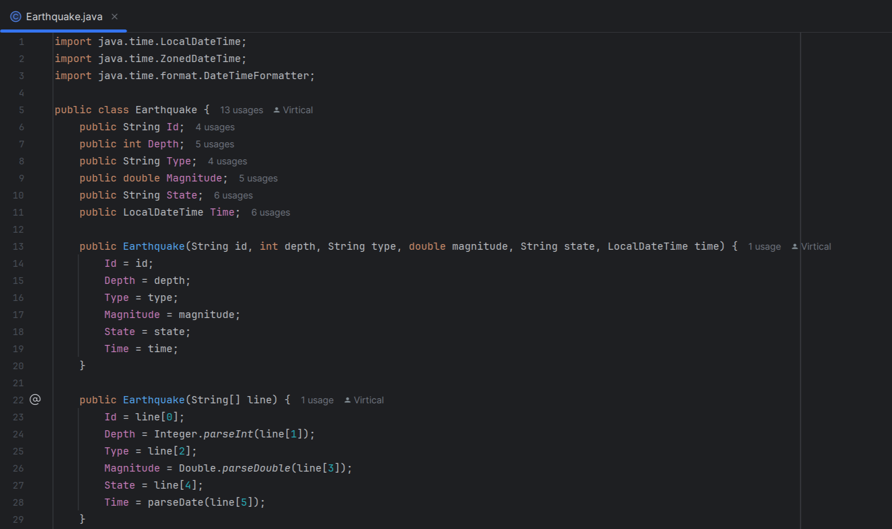
2) Создание класса EarthquakeHandler и метода ParseEarthquakesFromCSV, который парсит файл и возвращает список землетрясений
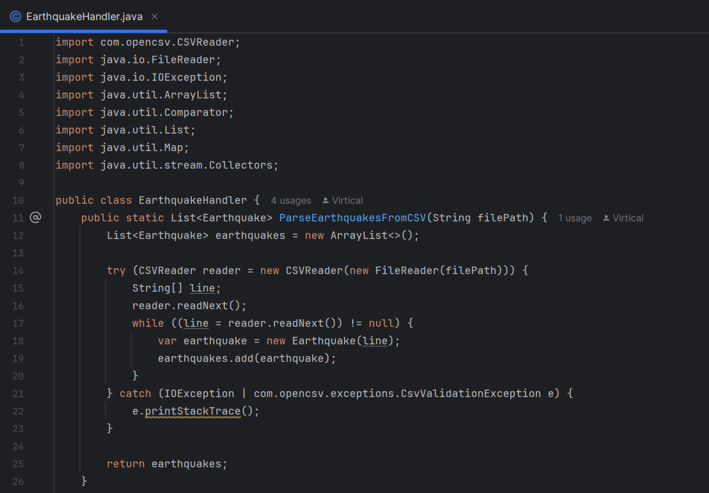
3) Создание класса Database и вспомогательных методов, для открытия БД, создания таблицы, сохранения данных, и закрытия БД
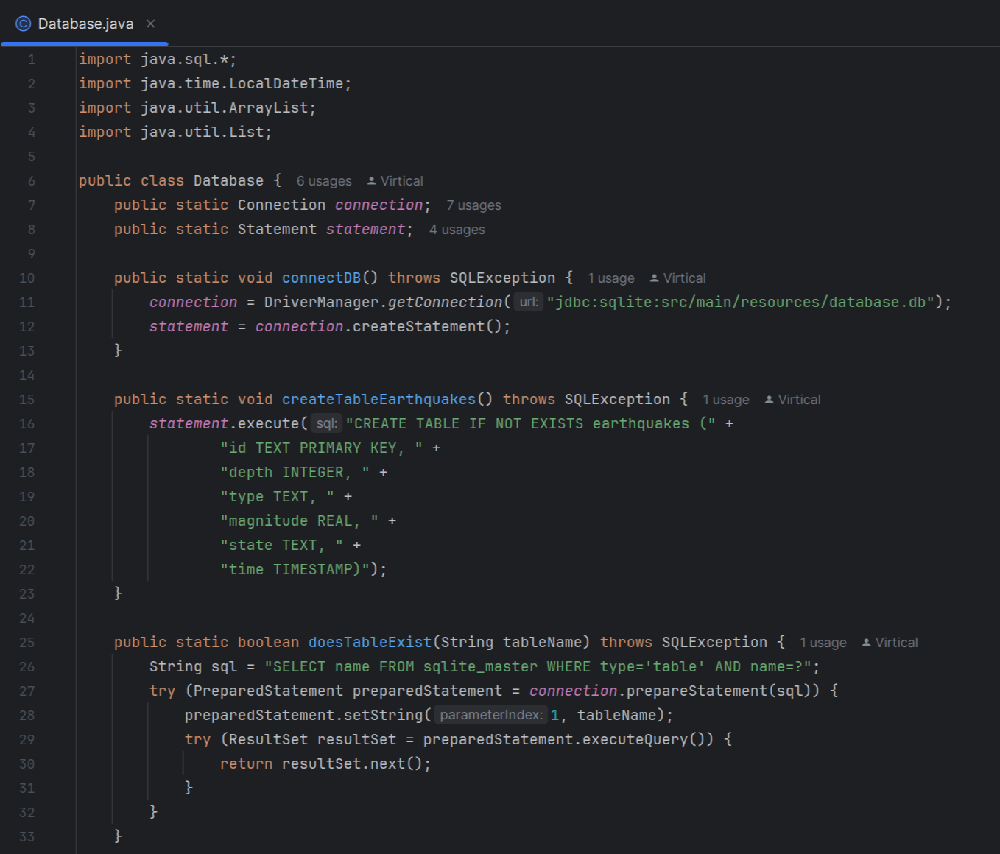
4) Сохранение данных в Базу Данных
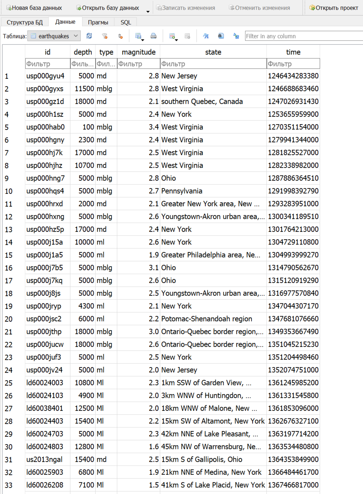
5) Создание метода для получения данных из Базы Данных
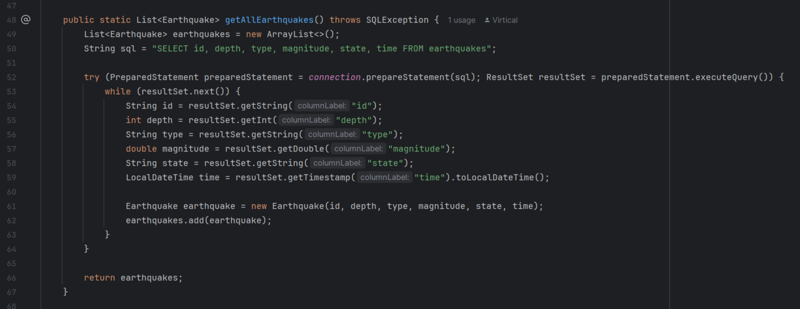
6) В классе EarthquakeHandler создание метода getEarthquakeCountsPerYear для получения количества зелетрясений по годам
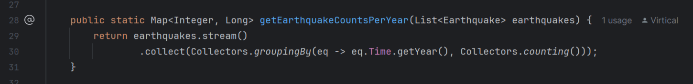
7) Создание класса EarthquakeChart для создания графика количества землетрясений по годам
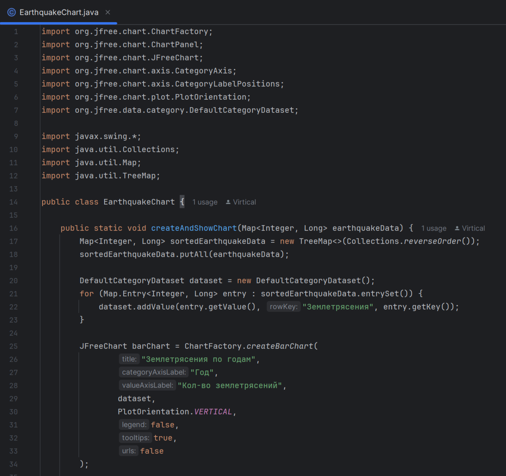
8) В классе EarthquakeHandler создание метода calculateAverageMagnitudeByState, который по заданному Штату считает среднюю магнитуду
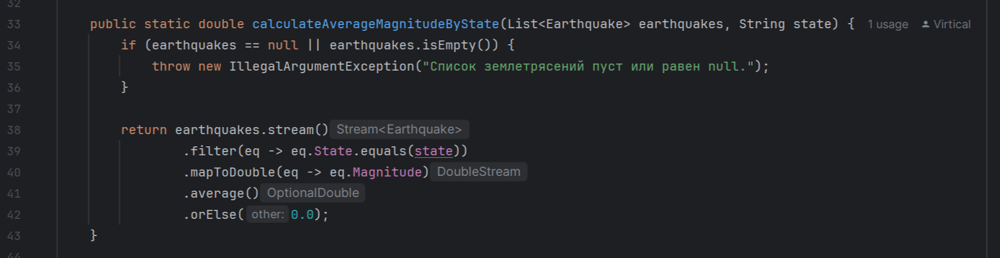
9) В классе EarthquakeHandler создание метода findStateWithDeepestEarthquake, который по заданному году находит Штат в котором произошло самое глубокое землетрясение в этом году
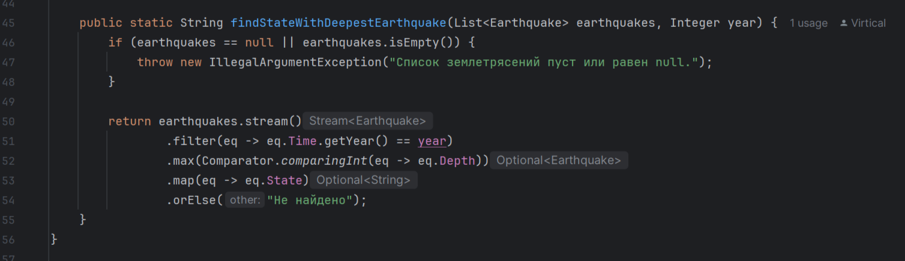
10) Вывод графика и данных о средней магнитуды для штата "West Virginia", название штата, в котором произошло самое глубокое землетрясение в 2013 году в консоль
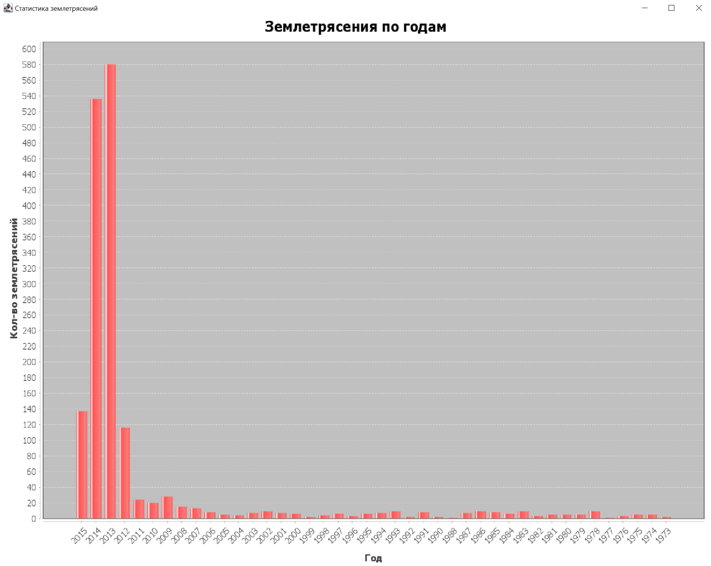
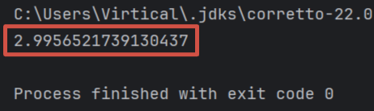
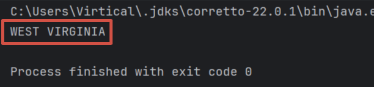
